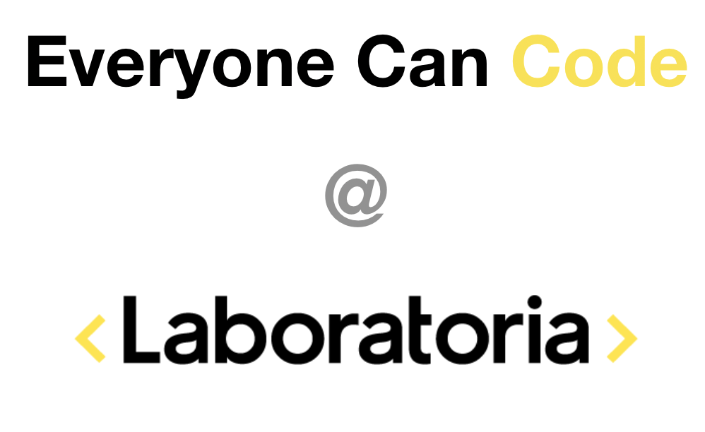
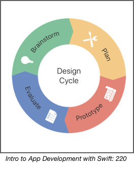
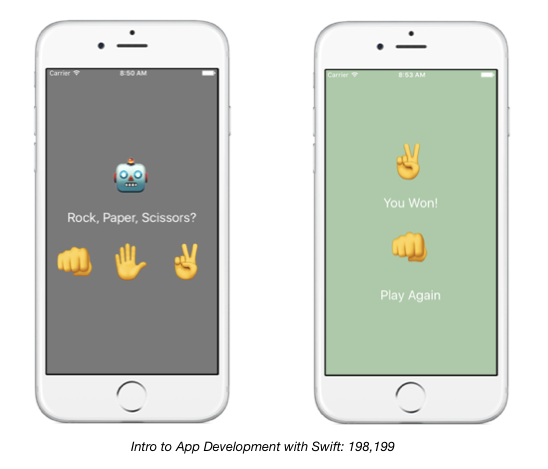
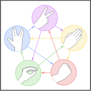
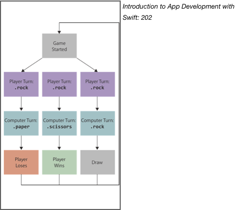
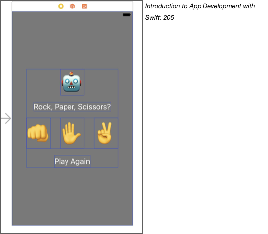

# RockPaperScissors

1. [Week 1](https://github.com/ECC-Laboratoria/RockPaperScissors/tree/master/Week1)
2. [Week 2](https://github.com/ECC-Laboratoria/RockPaperScissors/tree/master/Week2)


---



### 1. Preámbulo: ¿Cómo diseñar una app?

El mundo de las apps está lleno de ideas revolucionarias que pueden ser tan sencillas y tan complejas como uno quiera, pero siempre deben pasar por un ciclo de diseño sin importar la complejidad. Hay cuatro fases principales a la hora de diseña una app.

1. **Lluvia de ideas**: aquí es donde comienza una gran app. Comienza por  buscar un problema que te gustaría resolver y haz una lista de las posibles soluciones al problema. 

2. **Plan**: en esta etapa la idea es que planees los detalles de tu app. Por ejemplo, las historias de usuario, las funcionalidades de tu app, el diseño, etc. 

3. **Prototipo**: aquí vamos a hacer un prototipo (tanto de baja como de alta fidelidad) conocido como *“mock-up”* de tu app.

4. **Evaluar**: finalmente hay que probar nuestro prototipo. De preferencia hay que ir con usuarios reales que vayan a usar tu app y pídeles su opinión.

   

### 2. Overview del proyecto 

Para el primer proyecto vamos a desarrollar un juego llamado **Piedra, papel o tijera.** La idea del juego es la siguiente: 

- Dos jugadores se ven las caras (en nuestro caso será únicamente contra la computadora). 

- A la cuenta de tres, ambos jugadores escogen una opción: piedra (puño cerrado), papel (mano abierta) o tijeras (símbolo de amor y paz). 

- Cada opción le pueda ganar a la otra: 

- - Piedra tritura a las Tijeras. 
  - Tijeras cortan el Papel. 
  - Papel cubre a la Piedra.

Para este proyecto, no habrá necesidad de contar hasta tres pues solo podrás escoger una des las tres opciones y la computadora escogerá su opción. 



La imagen de la izquierda es nuestra vista central que contiene un label con el emoji del robot, otro label para el título del juego y tres botones con las tres opciones de juego. Desde aquí comenzará el juego y el usuario podrá darle click a una de las tres opciones (piedra, papel o tijera).

Posteriormente, los elementos visuales cambian y se ve la segunda pantalla (que realmente sigue siendo la primera pantalla solo que cambió el color de fondo y se escondieron algunos elementos) con la opción seleccionada por la computadora (arriba) en un label y la del usuario (abajo) con otro label. Al igual que otro label para indicar el resultado de la partida y un botón para reiniciar el juego. 

### 3. Objetivos del proyecto

1. El objetivo principal del proyecto es familiarizarse con el lenguaje de programación **Swift** al igual que aprender a usar los componentes gráficos básicos de **UIKit** dentro de Xcode. 
2. Como objetivo secundario, es importante que aprendas a diseñar una app y puedas hacerlo de manera estructurada mediante el ciclo de diseño de 4 fases. 

### 4. Consideraciones generales 

Es importante notar lo siguiente, al desarrollar una app hay dos elementos principales: el diseño y el código. Antes de comenzar a escribir líneas de código, es importante tener el diseño listo de nuestra app y hacer un análisis sobre las estructuras de datos, algoritmos, clases/estructuras, etc. 

**El código de este primer proyecto deberá ser completamente en Swift. 

### 5. Entregables 

1. Link del proyecto dentro de un repositorio en Github. 
2. Dentro del archivo README.md del repositorio, harás una descripción de tu app junto con screen shots de las vistas. Sean creativas en esta parte, contará como evaluación. Piensa en este archivo como un pitch de tu app donde el usuario será lo único que vea y con base en este archivo, el usuario decidirá si descarga tu app. 

### 6. Hacker Edition 

Una vez finalizado tu app con la versión **Piedra, papel o tijera,** aumenta el número de opciones con base en el siguiente juego: **Piedra, papel, tijera, lagarto o Spock.**



Reglas de este juego: 

- Tijeras cortan el Papel. 
- Papel cubre la Piedra. 
- Piedra aplasta al Lagarto. 
- Lagarto envenena a Spock. 
- Spock desvanece a las Tijeras. 
- Tijeras decapitan al Lagarto. 
- Lagarto se come al Papel. 
- Papel le gana a Spock. 
- Spock desaparece a la Piedra. 
- Finalmente, Piedra aplasta a las Tijeras. 


** La interfaz para este juego deber ser la misma, solo incrementas el número de opciones y modificas tu algoritmo para determinar el ganador con base en la opción dada por el usuario y la computadora. 

** En la sección de lecturas complementarias encontrarás un link a una descripción más detallada del juego. 

### 7. Checklist 

**Setup**

1. Clona el repo **ECC-Laboratoria** a tu escritorio. 

2. Crea un nuevo proyecto de Xcode:

3. 1. Selecciona un Single View App. 

   2. Nombra tu proyecto: PiedraPapelTijera

   3. Selecciona el destino donde guardarás tu proyecto (dentro del folder de tu repo). 

   4. 1. Ojo, asegúrate de **deseleccionar** la opción *“Create Git repository on my Mac”*.

4. Haz un commit inicial y llámalo: “Setup listo”

**Código**

1. Crea un archivo nuevo de Swift y llámalo *Sign.*

2. Dentro de este archivo crea una **enum** con los casos que representan cada signo (piedra, papel o tijera) y llama a la enumeración *Sign*. 

3. Agrega una propiedad calculada a cada caso y dale el emoji correspondiente. 

4. Hay cuatro estados posibles para el juego: 

5. 1. *Inicio*: la app despliega la vista principal y está a la espera de que el usuario seleccione una de las opciones. 
   2. *Ganar*: el usuario ganó el juego y la app despliega el mensaje correspondiente.
   3. *Perder:* el usuario perdió el juego y la app despliega el mensaje correspondiente.
   4. *Empatar:* tanto el usuario como la computadora seleccionaron el mismo signo y la app despliega el mensaje correspondiente. 

6. Crea un nuevo archivo de Swift y llámalo *GameState.* Dentro de este archivo crea una **enum** llamada *GameState.* 




6.  Agrega un método de instancia a la **enum** *Sign* que reciba como parámetro un *Sign* (que representa el *Sign* del oponente) y que regrese un *GameState* basado en la comparación del *Sign* del oponente con el propio *Sign.* 

7. **Random Sign:** para generar un signo aleatorio (representando la opción de la computadora) deberás importar el framework **GameplayKit** al archivo *Sign.swift.* 

1. 1. Agrega las siguientes líneas de código fuera de cualquier estructura o enumeración: 

      ```swift
      let randomChoice = GKRandomDistribution(lowestValue: 0, highestValue: 2) 
      ```

   2. ```swift
      func randomSign() -> Sign {
        let sign = randomChoice.nextInt()
      	if sign == 0 {
      		return .rock
      	} else if sign == 1 {
      		return .paper
      	} else {
      		return .scissors
        }
      }
      ```

**Vistas**: 

1. Vista y estructura de la vista central de la primera vista (1 label para el robot, 1 label para el título de la app, tres botones con los signos, 1 botón para jugar de nuevo) 

   


2. Crea las conexiones de los elementos gráficos con el archivo *ViewController.swift.* 

3. Genera el código necesario en *ViewController.swift* para completar el juego y conectar las vistas con las enumeraciones (*GameState.swift* y *Sign.swift*) para conectar todo. 

### 8. Pistas, tips y lecturas complementarias

- Intro to App Development with Swift: https://books.apple.com/us/book/intro-to-app-development-with-swift/id1118575552 

- - Plan de 4 pasos: Lección 21 
  - Funciones: Lección 6
  - Acciones y Conexiones: Lección 17
  - Enumeraciones: Lección 19
  - Extra: Lección 20 

- App Development with Swift: https://books.apple.com/us/book/app-development-with-swift/id1219117996

- The Swift Programing Guide: https://books.apple.com/us/book/the-swift-programming-language-swift-5-0/id881256329